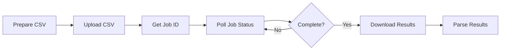

# BatchData V2 API Implementation Plan (Wallet Credits)

**Document Version**: 2.0
**Created**: 2025-11-17
**Status**: Complete Refactor for V2 API
**Critical Change**: Using V2 API with wallet credits instead of V3 subscription

---

## 📋 Executive Summary

### The Situation
- **V3 requires subscription plan** (which you don't have)
- **V2 works with wallet credits** (which you have)
- Your existing async code is actually correct for V2, just needs fixes
- We built V3 sync client unnecessarily - V2 doesn't support sync

### The Solution
1. **Fix base URLs** to use V2 endpoints
2. **Fix the existing async implementation** (CSV upload + job polling)
3. **Fix state field issue** in data transformation
4. **Keep the smart indexing plans** for cost savings

---

## 🔄 V2 API Flow (How It Actually Works)



### V2 Endpoints
- **Upload**: `POST /api/v2/property/skip-trace/async`
- **Status**: `GET /api/v2/jobs/{job_id}`
- **Download**: `GET /api/v2/jobs/{job_id}/download`

---

## ✅ PHASE 0: Fix Base URLs (IMMEDIATE)

### Files to Update

#### 1. `Batchdata/template_config.xlsx`
```
CONFIG sheet:
api.base_url: https://api.batchdata.com/api/v2  ← Change from v3 to v2
```

#### 2. `Batchdata/tests/batchdata_local_input.xlsx`
```
CONFIG sheet:
api.base_url: https://api.batchdata.com/api/v2  ← Change from v3 to v2
```

#### 3. `Batchdata/src/batchdata.py` (line 18)
```python
# Change default from:
def __init__(self, api_keys: Dict[str, str], base_url: str = "https://api.batchdata.com/api/v3"):

# To:
def __init__(self, api_keys: Dict[str, str], base_url: str = "https://api.batchdata.com/api/v2"):
```

---

## 🔧 PHASE 1: Fix Async Implementation

### The Real V2 Flow

#### Step 1: CSV Upload
```python
# V2 requires CSV file upload, not JSON
POST /api/v2/property/skip-trace/async
Content-Type: multipart/form-data
File: skip_trace_input.csv
```

#### Step 2: Poll Job Status
```python
GET /api/v2/jobs/{job_id}
# Returns: {"status": "pending|processing|complete|failed"}
```

#### Step 3: Download Results
```python
GET /api/v2/jobs/{job_id}/download
# Returns: CSV file with results
```

### Fix the Existing Code

The existing `BatchDataClient` in `batchdata.py` is already built for this! We just need to:

1. **Fix the endpoints** (they might be using v3 paths)
2. **Fix the state field** in CSV generation
3. **Add proper error handling**

### Key Files
- `Batchdata/src/batchdata.py` - Already has CSV upload logic
- `Batchdata/src/io.py` - Handles CSV I/O
- `Batchdata/src/run.py` - Orchestrates the pipeline

---

## 🐛 PHASE 2: Fix Data Issues

### Issue #1: Missing State Field

**Problem**: State field is empty in all records
**Solution**: Use "ECORP_STATE" column from Ecorp data

**File**: `Batchdata/src/transform.py` (line ~140)

```python
# In ecorp_to_batchdata_records function:
if agent_address:
    address_parts = parse_address(agent_address)

    # FIX: Add state from ECORP_STATE column
    if not address_parts.get('state') or address_parts['state'] == '':
        domicile_state = ecorp_row.get('ECORP_STATE', '')
        if domicile_state:
            address_parts['state'] = normalize_state(domicile_state)
        elif 'MARICOPA' in str(ecorp_row.get('ECORP_COUNTY', '')).upper():
            address_parts['state'] = 'AZ'  # Default for Maricopa
```

### Issue #2: CSV Format for V2

V2 expects specific CSV columns:
```csv
first_name,last_name,address,city,state,zip
John,Doe,123 Main St,Phoenix,AZ,85001
```

Make sure the CSV generation creates these exact columns.

---

## 💰 PHASE 3: Smart Indexing (Still Valid!)

Even with V2, we can still implement smart indexing to save costs:

### Deduplication Strategy
1. Group by ECORP_INDEX_# + person name
2. Process unique persons only
3. Copy results to duplicates
4. **Save 30-40% on API costs**

This works the same whether using V2 or V3!

---

## 🧪 PHASE 4: Testing V2

### Test Checklist

#### 1. Test API Connection
```bash
# Check if V2 endpoints work with your wallet credits
curl -X POST https://api.batchdata.com/api/v2/property/skip-trace/async \
  -H "Authorization: Bearer YOUR_API_KEY" \
  -F "file=@test.csv"
```

#### 2. Test State Field Fix
```python
# Verify state is populated in CSV
python3 -c "
import pandas as pd
df = pd.read_csv('skip_trace_input.csv')
print(f'Records with state: {df[\"state\"].notna().sum()}/{len(df)}')
"
```

#### 3. Test Full Pipeline
```bash
# Run with small batch
cd Batchdata
python3 src/run.py --input tests/batchdata_local_input.xlsx --dry-run
```

---

## 📝 Implementation Steps

### Today's Tasks

1. **Update all base URLs to V2** (5 minutes)
   ```bash
   # Quick sed command to replace v3 with v2
   find . -type f -name "*.py" -exec sed -i '' 's/api\/v3/api\/v2/g' {} \;
   ```

2. **Fix state field in transform.py** (10 minutes)
   - Apply the ECORP_STATE fix

3. **Test with your wallet credits** (5 minutes)
   - Upload small CSV
   - Verify job creation
   - Check status polling

4. **Run full pipeline** (10 minutes)
   - Process a month's data
   - Verify output

---

## 🎯 Key Differences: V2 vs V3

| Feature | V2 (Wallet Credits) | V3 (Subscription) |
|---------|-------------------|------------------|
| **Payment** | Pay-per-use credits | Monthly subscription |
| **Format** | CSV upload | JSON requests |
| **Processing** | Async (polling) | Sync or Async |
| **Endpoints** | `/api/v2/...` | `/api/v3/...` |
| **Job Management** | Required | Optional |
| **Response** | CSV download | JSON response |

---

## 🚨 Important Notes

### What Changes
- Base URL: `v3` → `v2`
- No sync client needed (V2 is async only)
- Must use CSV format
- Must poll for job completion

### What Stays the Same
- API keys (same keys work for V2 and V3)
- Smart indexing strategy
- Output schema
- Cost savings approach

---

## 📊 Cost Estimates (V2 Wallet Credits)

| Service | Cost per Record | Your Balance | Records Possible |
|---------|-----------------|--------------|------------------|
| Skip-trace | $0.07 | Check dashboard | Balance ÷ $0.07 |
| Phone verify | $0.007/phone | Check dashboard | Balance ÷ $0.007 |
| DNC | $0.002/phone | Check dashboard | Balance ÷ $0.002 |

---

## ✅ Quick Start Commands

```bash
# 1. Fix base URLs
find Batchdata -name "*.xlsx" -exec echo "Update {} to use api/v2" \;

# 2. Test V2 endpoint
export BD_SKIPTRACE_KEY="your-key"
curl -X POST https://api.batchdata.com/api/v2/property/skip-trace/async \
  -H "Authorization: Bearer $BD_SKIPTRACE_KEY" \
  -F "file=@test.csv"

# 3. Run pipeline
cd Batchdata
python3 src/run.py --input tests/batchdata_local_input.xlsx

# 4. Check results
ls -la Complete/
```

---

## 🎉 Expected Outcome

Once you:
1. Change base URLs to V2
2. Fix the state field
3. Run the existing async pipeline

**It should work!** Your existing async code is already built for V2 - we just had the wrong base URL and missing state data.

---

**Next Update**: After confirming V2 works
**Support**: Check BatchData V2 docs at developer.batchdata.com