# ADHS ETL Pipeline Flow

## Complete Data Pipeline Architecture

```mermaid
flowchart TD
    %% Input Stage
    RawInput["📁 ALL-MONTHS/Raw M.YY/<br/>Raw ADHS Excel Files<br/>(Monthly Provider Data)"]

    %% Configuration
    FieldMap["⚙️ field_map.yml<br/>Column Mappings"]
    EnvConfig["⚙️ .env<br/>API Keys & Config"]

    %% Main ETL Process
    MainETL["🔄 ADHS ETL Core<br/>src/adhs_etl/transform.py<br/>• Field mapping<br/>• Deduplication (fuzzy)<br/>• Geocoding<br/>• Provider grouping"]

    %% Primary Outputs
    Reformat["📊 Reformat/M.YY_Reformat_{timestamp}.xlsx<br/>• MONTH, YEAR<br/>• PROVIDER_TYPE, PROVIDER<br/>• ADDRESS, CITY, ZIP<br/>• FULL_ADDRESS<br/>• CAPACITY<br/>• LONGITUDE, LATITUDE<br/>• COUNTY<br/>• PROVIDER_GROUP_INDEX_#"]

    AllToDate["📊 All-to-Date/M.YY_Reformat_All_to_Date_{timestamp}.xlsx<br/>Cumulative data across all processed months"]

    Analysis["📊 Analysis/M.YY_Analysis_{timestamp}.xlsx<br/>3 Sheets:<br/>• Summary<br/>• Blanks Count<br/>• Analysis (lost licenses, tracking)"]

    %% APN Processing Stage
    APNFilter["🔍 APN Filter<br/>Extract MARICOPA County records only"]
    APNUpload["📤 APN/Upload/M.YY_APN_Upload_{timestamp}.xlsx<br/>MARICOPA-only records<br/>prepared for parcel lookup"]

    APNLookup["🔄 APN Lookup Service<br/>src/adhs_etl/mca_api.py<br/>Assessor Parcel Number extraction<br/>Uses: usaddress library"]

    APNComplete["✅ APN/Complete/M.YY_APN_Complete_{timestamp}.xlsx<br/>Upload data + APN fields<br/>Ready for property enrichment"]

    %% MCAO Processing Stage
    MCAOFilter["🔍 MCAO Filter<br/>Valid APNs only"]
    MCAOUpload["📤 MCAO/Upload/M.YY_MCAO_Upload_{timestamp}.xlsx<br/>Filtered APNs for property lookup"]

    MCAOClient["🔄 MCAO API Client<br/>src/adhs_etl/mcao_client.py<br/>Maricopa County Assessor API<br/>6 Endpoints:<br/>• parcel<br/>• address<br/>• owner-details<br/>• propertyinfo<br/>• residential-details<br/>• valuations"]

    MCAOComplete["✅ MCAO/Complete/M.YY_MCAO_Complete_{timestamp}.xlsx<br/>84 Property Fields:<br/>• Owner information<br/>• Property details<br/>• Valuations<br/>• Tax information<br/>• Legal descriptions<br/>• Map references<br/>• Parcel statistics"]

    %% Ecorp Processing Stage
    EcorpFilter["🔍 Ecorp Filter<br/>Extract 4 columns:<br/>• FULL_ADDRESS<br/>• COUNTY<br/>• Owner_Ownership<br/>• OWNER_TYPE"]

    EcorpUpload["📤 Ecorp/Upload/M.YY_Ecorp_Upload_{timestamp}.xlsx<br/>4 columns prepared for<br/>ACC entity lookup"]

    EcorpProcessor["🔄 Ecorp Processor<br/>src/adhs_etl/ecorp.py<br/>Arizona Corporation Commission<br/>Entity Lookup<br/>Requires: Chrome browser"]

    EcorpComplete["✅ Ecorp/Complete/M.YY_Ecorp_Complete_{timestamp}.xlsx<br/>Upload (4 cols) + Entity Data (89 cols):<br/>• Entity name & type<br/>• Filing number & status<br/>• Principal names & addresses<br/>• Statutory agent info<br/>• Registration dates"]

    %% BatchData Processing Stage (Optional)
    BatchDataFilter["🔍 BatchData Filter<br/>Optional post-processing"]

    BatchDataUpload["📤 Batchdata/Upload/M.YY_BatchData_Upload_{timestamp}.xlsx<br/>Prepared for skip-trace APIs"]

    BatchDataPipeline["🔄 BatchData Pipeline<br/>Batchdata/src/<br/>• Phone discovery<br/>• Email discovery<br/>• DNC/TCPA filtering<br/>• Phone verification"]

    BatchDataComplete["✅ Batchdata/Complete/M.YY_BatchData_Complete_{timestamp}.xlsx<br/>Full contact enrichment:<br/>• Verified phone numbers<br/>• Email addresses<br/>• Compliance flags"]

    %% Unknown Columns Handler
    UnknownCols["⚠️ field_map.TODO.yml<br/>Auto-generated for<br/>unknown columns"]

    %% Flow connections
    RawInput --> MainETL
    FieldMap -.-> MainETL
    EnvConfig -.-> MainETL

    MainETL --> Reformat
    MainETL --> AllToDate
    MainETL --> Analysis
    MainETL -.->|"Unknown columns"| UnknownCols

    %% APN Flow
    Reformat --> APNFilter
    APNFilter -->|"COUNTY = MARICOPA"| APNUpload
    APNUpload --> APNLookup
    APNLookup --> APNComplete

    %% MCAO Flow
    APNComplete --> MCAOFilter
    MCAOFilter -->|"Valid APNs"| MCAOUpload
    MCAOUpload --> MCAOClient
    EnvConfig -.->|"MCAO_API_KEY"| MCAOClient
    MCAOClient --> MCAOComplete

    %% Ecorp Flow
    MCAOComplete --> EcorpFilter
    EcorpFilter --> EcorpUpload
    EcorpUpload --> EcorpProcessor
    EcorpProcessor --> EcorpComplete

    %% BatchData Flow (Optional)
    EcorpComplete -.->|"Optional"| BatchDataFilter
    BatchDataFilter -.-> BatchDataUpload
    BatchDataUpload -.-> BatchDataPipeline
    EnvConfig -.->|"Skip-trace API keys"| BatchDataPipeline
    BatchDataPipeline -.-> BatchDataComplete

    %% Styling
    classDef inputStyle fill:#e1f5ff,stroke:#0288d1,stroke-width:2px
    classDef processStyle fill:#fff3e0,stroke:#f57c00,stroke-width:2px
    classDef outputStyle fill:#e8f5e9,stroke:#388e3c,stroke-width:2px
    classDef configStyle fill:#f3e5f5,stroke:#7b1fa2,stroke-width:2px
    classDef optionalStyle fill:#fce4ec,stroke:#c2185b,stroke-width:2px,stroke-dasharray: 5 5
    classDef warningStyle fill:#fff9c4,stroke:#f57f17,stroke-width:2px

    class RawInput inputStyle
    class FieldMap,EnvConfig configStyle
    class MainETL,APNLookup,MCAOClient,EcorpProcessor processStyle
    class APNFilter,MCAOFilter,EcorpFilter processStyle
    class Reformat,AllToDate,Analysis,APNUpload,APNComplete,MCAOUpload,MCAOComplete,EcorpUpload,EcorpComplete outputStyle
    class BatchDataFilter,BatchDataUpload,BatchDataPipeline,BatchDataComplete optionalStyle
    class UnknownCols warningStyle
```



## Pipeline Stages Summary

### Stage 1: Main ETL (Required)
**Input**: Raw ADHS Excel files from `ALL-MONTHS/Raw M.YY/`
**Process**: Field mapping, deduplication, geocoding, provider grouping
**Outputs**:
- `Reformat/M.YY_Reformat_{timestamp}.xlsx` - Standardized provider data
- `All-to-Date/M.YY_Reformat_All_to_Date_{timestamp}.xlsx` - Cumulative historical data
- `Analysis/M.YY_Analysis_{timestamp}.xlsx` - Business analysis with 3 sheets

### Stage 2: APN Lookup (Conditional - MARICOPA only)
**Input**: Reformat output filtered for MARICOPA county
**Process**: Assessor Parcel Number extraction using address parsing
**Outputs**:
- `APN/Upload/M.YY_APN_Upload_{timestamp}.xlsx` - MARICOPA records for lookup
- `APN/Complete/M.YY_APN_Complete_{timestamp}.xlsx` - Enriched with parcel numbers

### Stage 3: MCAO Property Data (Conditional - Valid APNs)
**Input**: APN Complete with valid parcel numbers
**Process**: Maricopa County Assessor API calls (6 endpoints)
**Outputs**:
- `MCAO/Upload/M.YY_MCAO_Upload_{timestamp}.xlsx` - Filtered APNs
- `MCAO/Complete/M.YY_MCAO_Complete_{timestamp}.xlsx` - 84 property fields

### Stage 4: Ecorp Entity Lookup (Conditional)
**Input**: MCAO Complete filtered for entity columns
**Process**: ACC entity lookup via browser automation
**Outputs**:
- `Ecorp/Upload/M.YY_Ecorp_Upload_{timestamp}.xlsx` - 4 columns for lookup
- `Ecorp/Complete/M.YY_Ecorp_Complete_{timestamp}.xlsx` - 93 total columns (4 + 89 entity fields)

### Stage 5: BatchData Enrichment (Optional)
**Input**: Ecorp Complete
**Process**: Skip-trace APIs for contact discovery and verification
**Outputs**:
- `Batchdata/Upload/M.YY_BatchData_Upload_{timestamp}.xlsx` - Prepared for APIs
- `Batchdata/Complete/M.YY_BatchData_Complete_{timestamp}.xlsx` - Full contact data

**Naming Convention**: All outputs follow `M.YY_{Stage}_{timestamp}.xlsx` where `{timestamp}` is `MM.DD.HH-MM-SS` (12-hour format, no AM/PM).

## Key Entry Points

### Primary Method
```bash
poetry run python scripts/process_months_local.py
```
Interactive menu for batch processing multiple months

### Alternative CLI
```bash
poetry run adhs-etl run --month 1.25 --raw-dir ./ALL-MONTHS/Raw\ 1.25 [--dry-run]
```
Single month processing with optional dry-run mode

## Data Column Progression

| Stage | Column Count | Key Additions |
|-------|-------------|---------------|
| Reformat | ~15 cols | MONTH, YEAR, PROVIDER_TYPE, PROVIDER, ADDRESS, CITY, ZIP, FULL_ADDRESS, CAPACITY, LONGITUDE, LATITUDE, COUNTY, PROVIDER_GROUP_INDEX_# |
| APN Complete | +APN fields | Assessor Parcel Numbers |
| MCAO Complete | +106 cols | Owner details, property info, valuations, tax data, legal descriptions, map references, parcel stats |
| Ecorp Complete | +22 cols | Entity name/type, filing number/status, principals, statutory agent, registration dates |
| BatchData Complete | +Contact cols | Verified phones, emails, DNC/TCPA flags |

## Configuration Requirements

### Environment Variables
```bash
# Main ETL
MCAO_API_KEY=<maricopa-county-assessor-api-key>
FUZZY_THRESHOLD=80.0
LOG_LEVEL=INFO

# BatchData (Optional - Stage 5)
BD_SKIPTRACE_KEY=<batchdata-skiptrace-api-key>
BD_ADDRESS_KEY=<batchdata-address-api-key>
BD_PROPERTY_KEY=<batchdata-property-api-key>
BD_PHONE_KEY=<batchdata-phone-api-key>
```

### Field Mapping
- Primary: `field_map.yml` - Main column mappings
- Auto-generated: `field_map.TODO.yml` - Unknown columns flagged with WARNING

### External Dependencies
- Chrome browser (Ecorp processing)
- usaddress library (APN lookup)
- MCAO API access (Property data)
- Skip-trace API keys (BatchData - optional)
